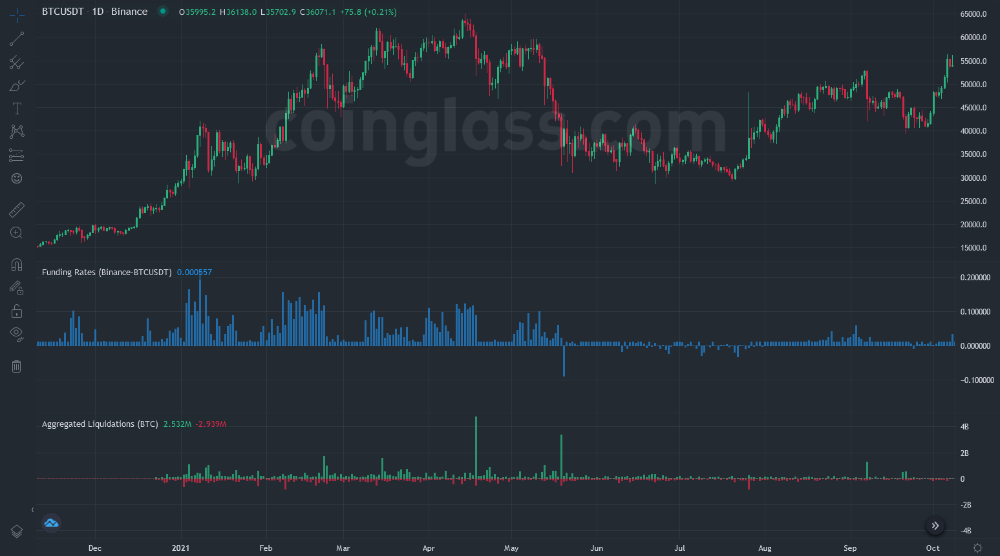

# Go Trading Bot

This bot is experimental.

### Why using Go ?

* First because I wanted to learn Go, so that's a good project to learn it.
* Also, Go is a multithreaded language, meaning that you can execute two tasks in the same time by using multiple cores of your processor. That's an enormous advantage because this program fetches data from multiple APIs. So you don't have to execute the first query, then executing the second.
* Finally because even though Go is garbage-collected, [it's actually really fast](https://youtu.be/Z0GX2mTUtfo)!

### How this bot works ?

It uses an "indicator" called **funding rate**.

##### What is funding rate ?

On a high-level explanation, funding rate indicates if there are more short or long positions on a derivative market (here BTC-PERP). A long/short position has a liquidation price, more or less tight according to the leverage.__
And basically, a long position liquidated creates a sell-order in the spot. Vice-versa for a short position. This is how BTC suddenly felt in May 2021: longs got liquidated, so it created short-orders in the spot = the price fall, and so even more longs got liquidated etc... This is a domino/snowball effect.

As you see in this chart, we got liquidations record (bottom indicator).

And most of the time, these are **market makers** that trigger these liquidations.
> But, why ?__
Market makers are corporations working for exchanges like Binance. Their goal is to provide liquidity to market's participants, so that the market is liquid (= you can always buy or sell the asset) and therefore it creates transactions where the exchange take fees from it.__
So when a market maker sees that at $1000 higher there are liquidations to trigger (= liquidate shorts and create buy-market orders), and also sell-limit orders, he will buy to rise the price to go $1000 higher and so the liquidations will be triggered = buy-market orders created that will be filled with the sell-limit orders. So many transactions will be executed, and the exchange is happy.

##### How this bot uses funding rate to his advantage

It buys BTC when funding rate is negative for at least two weeks in a row (you can see in the previous image that when two negative candles are in a row was the good period to buy). So that we know there are liquidations to be triggered higher.__
If the funding rate exceeds 0.05, the bot **sells**(but don't **short**) the asset.

And for the moment that's pretty much it! Maybe in the future the bot will also use liquidations or limit-orders to be more accurate.
